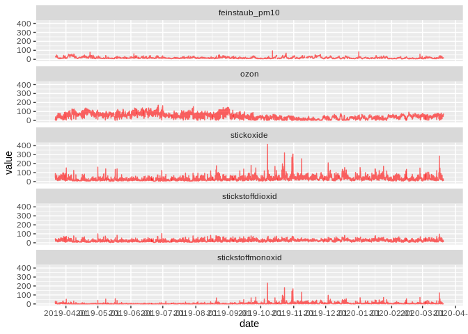

Air Pollution in Berlin during Corona
================
Maximilian Nölscher
2020-03-18

``` r
library(sf)
library(tidyverse)
library(lubridate)
```

# Data Import

``` r
data_background <- read_csv2('raw_data/ber_mc010_20190401-20200331.csv', skip = 3)
```

Column names

``` r
col_names <- read_csv2('raw_data/ber_mc010_20190401-20200331.csv') %>% 
  slice(1) %>% 
  pivot_longer(cols = everything()) %>% 
  pull(value)
```

Rename columns of `data_background`

``` r
data_background <- data_background %>% 
  set_names(col_names) %>% 
  janitor::clean_names() %>% 
  rename(date = messkomponente)
```

Fix date column

``` r
data_background <- data_background %>% 
  mutate(date = dmy_hm(date))
```

Add columns for year, month, …

``` r
data_background <- data_background %>% 
  mutate(year = year(date)) %>% 
  mutate(month = month(date)) %>% 
  mutate(week = week(date)) %>% 
  mutate(day = day(date)) %>% 
  select(date, year, month, week, day, everything())
```

Show the dataframe

``` r
data_background
```

    ## # A tibble: 8,426 x 10
    ##    date                 year month  week   day feinstaub_pm10
    ##    <dttm>              <dbl> <dbl> <dbl> <int>          <dbl>
    ##  1 2019-04-01 23:00:00  2019     4    13     1             13
    ##  2 2019-04-02 00:00:00  2019     4    14     2             14
    ##  3 2019-04-02 01:00:00  2019     4    14     2             14
    ##  4 2019-04-02 02:00:00  2019     4    14     2             14
    ##  5 2019-04-02 03:00:00  2019     4    14     2             14
    ##  6 2019-04-02 04:00:00  2019     4    14     2             14
    ##  7 2019-04-02 05:00:00  2019     4    14     2             16
    ##  8 2019-04-02 06:00:00  2019     4    14     2             18
    ##  9 2019-04-02 07:00:00  2019     4    14     2             19
    ## 10 2019-04-02 08:00:00  2019     4    14     2             21
    ## # … with 8,416 more rows, and 4 more variables: stickstoffmonoxid <dbl>,
    ## #   stickstoffdioxid <dbl>, stickoxide <dbl>, ozon <dbl>

# First visualizations

``` r
variables <- c("feinstaub_pm10", "stickstoffmonoxid", "stickstoffdioxid", "stickoxide", "ozon")
```

``` r
data_background %>% 
  pivot_longer(cols = one_of(variables)) %>% 
  ggplot(aes(date, value, group = name)) +
  geom_line(colour = 'red',
            alpha = .6) +
  scale_x_datetime(date_breaks = "month") +
  facet_wrap(~name, ncol = 1)
```


