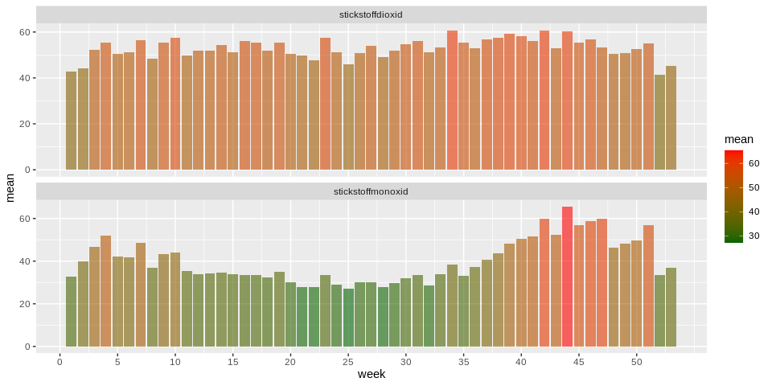
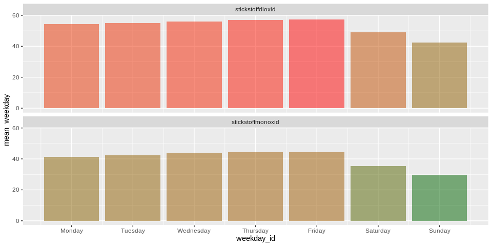
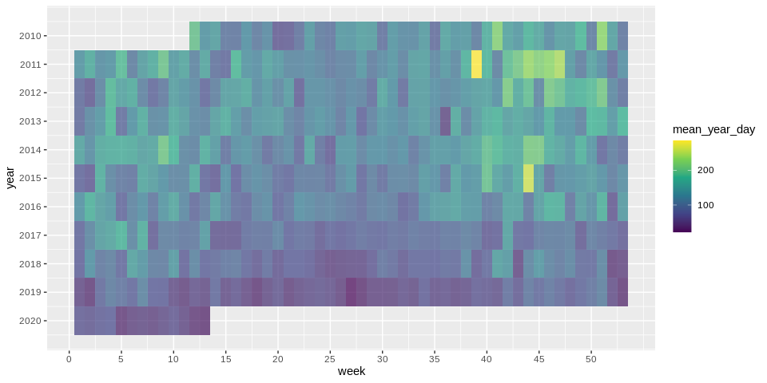

Air Pollution in Berlin during Corona
================
Maximilian Nölscher
2020-03-22

``` r
library(sf)
library(tidyverse)
library(lubridate)
```

# Data Import

Path to file

``` r
path_to_file <- "raw_data/verkehr/"
```

List all files in path

``` r
files <- path_to_file %>% 
  list.files() %>% 
  paste0(path_to_file, .)
```

``` r
data_background <- files %>% 
  map_dfr(~read_csv2(., skip = 3))
```

Column names

``` r
col_names <- files[1] %>% 
  read_csv2() %>% 
  slice(1) %>% 
  pivot_longer(cols = everything()) %>% 
  pull(value)
```

Rename columns of `data_background`

``` r
data_background <- data_background %>% 
  set_names(col_names) %>% 
  janitor::clean_names() %>% 
  rename(date = messkomponente)
```

Fix date column

``` r
data_background <- data_background %>% 
  mutate(date = dmy_hm(date))
```

Remove duplicate observations

``` r
data_background <- data_background %>% 
  distinct(date, .keep_all = TRUE)
```

Add columns for year, month, …

``` r
data_background <- data_background %>% 
  mutate(year = year(date)) %>% 
  mutate(month = month(date)) %>% 
  mutate(week = week(date)) %>% 
  mutate(day = day(date)) %>% 
  mutate(weekday = weekdays(date)) %>% 
  mutate(daytime = hour(date)) %>% 
  mutate(yearday = yday(date)) %>% 
  select(date, year, month, week, day, weekday, daytime, yearday, everything())
```

Show the dataframe

``` r
data_background
```

    ## # A tibble: 87,563 x 11
    ##    date                 year month  week   day weekday daytime yearday
    ##    <dttm>              <dbl> <dbl> <dbl> <int> <chr>     <int>   <dbl>
    ##  1 2010-03-23 00:00:00  2010     3    12    23 Tuesday       0      82
    ##  2 2010-03-23 01:00:00  2010     3    12    23 Tuesday       1      82
    ##  3 2010-03-23 02:00:00  2010     3    12    23 Tuesday       2      82
    ##  4 2010-03-23 03:00:00  2010     3    12    23 Tuesday       3      82
    ##  5 2010-03-23 04:00:00  2010     3    12    23 Tuesday       4      82
    ##  6 2010-03-23 05:00:00  2010     3    12    23 Tuesday       5      82
    ##  7 2010-03-23 06:00:00  2010     3    12    23 Tuesday       6      82
    ##  8 2010-03-23 07:00:00  2010     3    12    23 Tuesday       7      82
    ##  9 2010-03-23 08:00:00  2010     3    12    23 Tuesday       8      82
    ## 10 2010-03-23 09:00:00  2010     3    12    23 Tuesday       9      82
    ## # … with 87,553 more rows, and 3 more variables: stickstoffmonoxid <dbl>,
    ## #   stickstoffdioxid <dbl>, stickoxide <dbl>

# First visualizations

``` r
variables <- c("stickstoffmonoxid", "stickstoffdioxid", "stickoxide")
```

Clean outliers

``` r
data_background <- data_background %>% 
  pivot_longer(cols = one_of(variables)) %>% 
  group_by(name) %>% 
  mutate(value = ifelse(value >= 1e4, NA, value)) %>% 
  mutate(value = zoo::na.approx(value)) %>% 
  pivot_wider()
```

``` r
data_background %>% 
  pivot_longer(cols = one_of(variables)) %>% 
  ggplot(aes(date, value, group = name)) +
  geom_line(colour = 'red',
            alpha = .6) +
  scale_x_datetime(date_breaks = "3 months",
               # date_minor_breaks = "1 month",
               date_labels = "%b\n'%y") +
  facet_wrap(~name, ncol = 1, scales = "free_y")
```


Weekly mean concentration

``` r
data_background %>% 
  select(-stickoxide) %>% 
  pivot_longer(cols = one_of(variables)) %>% 
  group_by(name, week) %>% 
  summarise(mean = mean(value, na.rm = TRUE)) %>% 
  ggplot(aes(week, mean, group = name, fill = mean)) +
  geom_col(alpha = .6) +
  # scale_x_datetime(date_breaks = "month") +
  scale_fill_gradient(low = 'darkgreen', high = 'red') +
  scale_x_continuous(breaks = seq(0, 52, 5))+
  facet_wrap(~name, ncol = 1, scales = "free_y")
```



Daily values compared to period mean

``` r
data_background %>% 
  pivot_longer(cols = one_of(variables)) %>% 
  group_by(name) %>% 
  mutate(mean = mean(value, na.rm = TRUE)) %>% 
  group_by(name) %>% 
  mutate(diff_to_mean = value - mean) %>% 
  group_by(name, year, month, day) %>% 
  summarise(daily_mean_diff_to_mean = mean(diff_to_mean, na.rm = TRUE)) %>% 
  mutate(date = as_date(str_c(year, month, day, sep = "-")),
         colour_category = if_else(daily_mean_diff_to_mean <= 0 , "negativ", "positiv")) %>% 
  ggplot(aes(date, 
             daily_mean_diff_to_mean, 
             group = name, 
             fill = daily_mean_diff_to_mean)) +
  geom_col() +
  # scale_fill_manual() +
  scale_fill_gradient2(low='darkgreen', mid='snow3', high='red') +
  scale_x_date(date_breaks = "3 month",
               date_minor_breaks = "1 month",
               date_labels = "%b\n'%y") +
  theme(legend.position = "none") +
  facet_wrap(~name, ncol = 1, scales = "free_y")
```


Mean daily values compared to period mean

``` r
data_background %>% 
  pivot_longer(cols = one_of(variables)) %>% 
  group_by(name) %>% 
  mutate(mean = mean(value, na.rm = TRUE)) %>% 
  ungroup() %>% 
  group_by(name) %>% 
  mutate(diff_to_mean = value - mean) %>% 
  ungroup() %>% 
  group_by(name, year, month, day) %>% 
  summarise(daily_mean_diff_to_mean = mean(diff_to_mean, na.rm = TRUE)) %>% 
  mutate(date = as_date(str_c(year, month, day, sep = "-")),
         colour_category = if_else(daily_mean_diff_to_mean <= 0 , "negative", "positive")) %>% 
  ggplot(aes(date, 
             daily_mean_diff_to_mean)) +
  geom_area(fill = "red", 
            alpha = .3) +
  geom_ribbon(aes(ymin = 0, ymax = ifelse(daily_mean_diff_to_mean >= 0,0,daily_mean_diff_to_mean)), 
              fill = "green", 
              alpha = .3) +
  # scale_fill_manual() +
  # scale_fill_gradient2(low='darkgreen', mid='snow3', high='red') +
  scale_x_date(date_breaks = "3 month",
               date_minor_breaks = "1 month",
               date_labels = "%b\n'%y") +
  theme(legend.position = "none") +
  facet_wrap(~name, ncol = 1, scales = "free_y")
```


``` r
days_in_week <- tibble(weekday = weekdays(x = as.Date(seq(7), origin = "1950-01-01")),
                       weekday_id = 1:7)
```

``` r
days_in_week_vec <- days_in_week %>% pull(weekday_id)

names(days_in_week_vec) <- days_in_week %>% pull(weekday)
```

Mean concentrations per weekday

``` r
data_background %>% 
  select(-stickoxide) %>%  
  pivot_longer(cols = one_of(variables)) %>% 
  group_by(name, weekday) %>%
  summarise(mean_weekday = mean(value, na.rm = TRUE)) %>% 
  group_by(name) %>% 
  left_join(days_in_week) %>% 
  arrange(weekday_id) %>% 
  ggplot(aes(weekday_id, mean_weekday, fill = mean_weekday, group = name)) +
  geom_col(alpha = .5) +
  theme(legend.position = "none") +
  scale_x_continuous(breaks = 1:7,
                   labels = pull(days_in_week, weekday)) +
  scale_fill_gradient(low = 'darkgreen', high = 'red') +
  facet_wrap(~name, ncol = 1)
```



Mean concentrations per per hour per weekday

``` r
data_background %>% 
  select(-stickoxide) %>% 
  pivot_longer(cols = one_of(variables)) %>% 
  group_by(name, weekday, daytime) %>%
  summarise(mean_weekday_daytime = mean(value, na.rm = TRUE)) %>% 
  group_by(name) %>% 
  left_join(days_in_week, by = "weekday") %>% 
  arrange(weekday_id, daytime) %>% 
  ggplot(aes(daytime, mean_weekday_daytime, fill = mean_weekday_daytime, group = name)) +
  geom_col(alpha = .5) +
  theme(legend.position = "none") +
  scale_fill_gradient(low = 'darkgreen', high = 'red') +
  facet_grid(weekday_id~name, scales = "free_y")
```


Mean concentrations per per hour per weekday

``` r
data_background %>% 
  select(-stickoxide) %>% 
  pivot_longer(cols = one_of(variables)) %>% 
  group_by(name, weekday, daytime) %>%
  summarise(mean_weekday_daytime = mean(value, na.rm = TRUE)) %>% 
  group_by(name) %>% 
  left_join(days_in_week, by = "weekday") %>% 
  arrange(weekday_id, daytime) %>% 
  ggplot(aes(daytime, weekday_id, fill = mean_weekday_daytime, group = name)) +
  geom_tile(alpha = .5) +
  theme(legend.position = "none") +
  scale_fill_gradient(low = 'darkgreen', high = 'red') +
  scale_y_reverse(breaks = 1:7,
                   labels = pull(days_in_week, weekday)) +
  facet_wrap(~name, ncol = 3, scales = "free_y")
```


``` r
data_background %>% 
  select(-stickstoffdioxid, -stickstoffmonoxid) %>% 
  pivot_longer(cols = one_of(variables)) %>% 
  group_by(name, year, week) %>% 
  summarise(mean_year_day = mean(value, na.rm = TRUE)) %>% 
  ggplot(aes(week, year, group = name, fill = mean_year_day)) +
  geom_tile(alpha = .7) +
  # scale_x_datetime(date_breaks = "month") +
  # scale_fill_gradient(low = 'darkgreen', high = 'red') +
  scale_fill_viridis_c() +
  scale_x_continuous(breaks = seq(0, 52, 5))+
  scale_y_reverse(breaks = unique(pull(data_background, year))) +
  facet_wrap(~name, ncol = 1, scales = "free_y")
```



``` r
data_background %>% 
  select(-stickstoffdioxid, -stickstoffmonoxid) %>% 
  pivot_longer(cols = one_of(variables)) %>% 
  group_by(name, year, yearday) %>% 
  summarise(mean_year_yearday = mean(value, na.rm = TRUE)) %>% 
  ggplot(aes(yearday, year, group = name, fill = mean_year_yearday)) +
  geom_tile(alpha = .7) +
  # scale_x_datetime(date_breaks = "month") +
  # scale_fill_gradient(low = 'darkgreen', high = 'red') +
  scale_fill_viridis_c() +
  scale_x_continuous(breaks = seq(0, 365, 10), 
                     guide = guide_axis(n.dodge = 2)) +
  scale_y_reverse(breaks = unique(pull(data_background, year))) +
  labs(fill = "mean") +
  facet_wrap(~name, ncol = 1, scales = "free_y")
```


