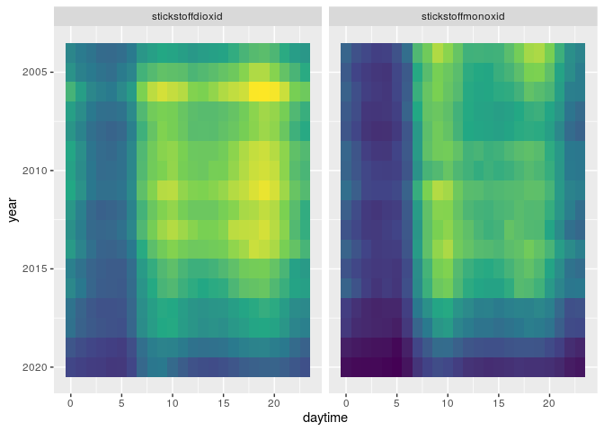
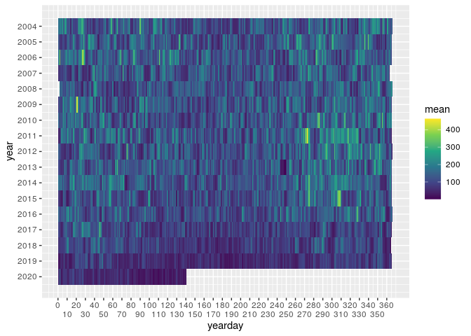
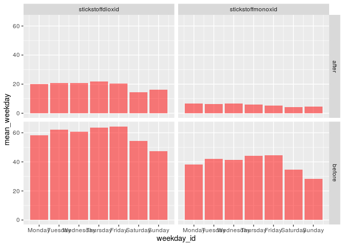
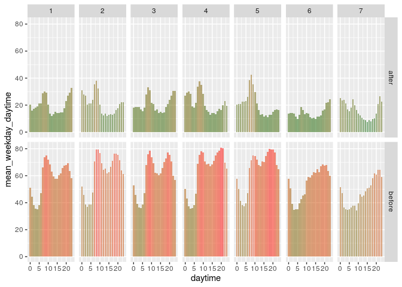

Air Pollution in Berlin during Corona
================
Maximilian Nölscher
2020-05-19

``` r
library(sf)
library(lubridate)
library(rvest)
library(tidyverse)
```

# Data Import through Web Scraping

Read website

``` r
airquality_website <- read_html("https://luftdaten.berlin.de/lqi")
```

Get station information

``` r
stations <- airquality_website %>%
  html_nodes(".lmn-table__cell--contentAsResponsiveHeadline") %>%
  html_text() %>%
  # tibble(text = .) %>%
  str_remove_all(" ") %>%
  # str_squish() %>%
  str_replace_all("\\n+", "_") %>%
  str_sub(2) %>%
  str_sub(end = -2) %>%
  tibble(station = .) %>%
  separate(col = "station", into = c("station", "type", "description"), sep = "_") %>%
  mutate(station_id = str_sub(station, 1, 3)) %>%
  mutate(station = str_sub(station, 4)) %>%
  select(station_id, everything())
```

Create template url for csv
download

``` r
url_template <- "https://luftdaten.berlin.de/station/mc+++.csv?group=pollution&period=1h&timespan=custom&start%5Bdate%5D=__________&start%5Bhour%5D=00&end%5Bdate%5D=----------&end%5Bhour%5D=00"
```

Replace

  - `+++` by the station id
  - `__________` by the start date
  - `----------` by the end date

Create station urls

``` r
download_urls <- stations %>%
  select(station_id) %>%
  mutate(url = url_template) %>%
  mutate(url = str_replace(url, "\\+++", station_id))
```

Define starting dates

``` r
start_year <- 2004

first_dates <- c(paste0(start_year, "-01-01"), paste0(start_year, "-12-31"))
```

Define a number of years to scrape data for

``` r
number_of_years <- Sys.Date() %>% year() - start_year + 1
```

Create tables with starting and ending dates, as it is only possible to
download data for 1 yeat per request

``` r
period_starting_dates <- tibble(
  from = seq.Date(as.Date(first_dates[1]),
    by = "year",
    length.out = number_of_years
  )
) %>%
  mutate_all(cus_fun_date_format_to_german)


period_ending_dates <- tibble(
  to = seq.Date(as.Date(first_dates[2]),
    by = "year",
    length.out = number_of_years
  )
) %>%
  mutate_all(cus_fun_date_format_to_german)
```

Make dataframe of urls to fetch

``` r
urls_to_fetch <- map2_dfr(period_starting_dates,
                          period_ending_dates,
                          .f = ~ cus_fun_fill_dates_in_url(pull(filter(download_urls, station_id == 115), url), 
                                                           .x, 
                                                           .y)
)
```

Download the data for all the defined years at one station

``` r
download <- urls_to_fetch %>% 
  pull(from) %>% 
  map(cus_fun_read_csv_from_url)
```

Remove header rows

``` r
station_data <- download %>% 
  map(~slice(., -c(2:3))) %>% 
  map(~set_names(., as_vector(slice(., 1)))) %>% 
  map(~slice(., -1))
```

Determine all columns that are common to all years

``` r
columns_to_keep <- station_data %>% 
  map(~names(.)) %>% 
  Reduce(intersect, .)
```

Fix column names

``` r
station_data <- station_data %>% 
  map_dfr(~select(., one_of(columns_to_keep))) %>% 
  rename("date" = 1) %>% 
  janitor::clean_names()
```

Fix date column

``` r
station_data <- station_data %>% 
  mutate(date = dmy_hm(date))
```

Remove possible duplicates

``` r
station_data <- station_data %>%
  distinct(date, .keep_all = TRUE)
```

Fix column data types

``` r
station_data <- station_data %>% 
  mutate_if(is.character, as.numeric)
```

Define parameters

``` r
variables <- c("stickstoffmonoxid", "stickstoffdioxid", "stickoxide")
```

Select those parameters

``` r
station_data <- station_data %>% 
  select(date, one_of(variables))
```

Add columns for year, month, …

``` r
station_data <- station_data %>%
  mutate(year = year(date)) %>%
  mutate(month = month(date)) %>%
  mutate(week = week(date)) %>%
  mutate(day = day(date)) %>%
  mutate(weekday = weekdays(date)) %>%
  mutate(daytime = hour(date)) %>%
  mutate(yearday = yday(date)) %>%
  select(date, year, month, week, day, weekday, daytime, yearday, everything())
```

Show the dataframe

``` r
station_data
```

    ## # A tibble: 143,152 x 11
    ##    date                 year month  week   day weekday daytime yearday
    ##    <dttm>              <dbl> <dbl> <dbl> <int> <chr>     <int>   <dbl>
    ##  1 2004-01-01 01:00:00  2004     1     1     1 Thursd…       1       1
    ##  2 2004-01-01 02:00:00  2004     1     1     1 Thursd…       2       1
    ##  3 2004-01-01 03:00:00  2004     1     1     1 Thursd…       3       1
    ##  4 2004-01-01 04:00:00  2004     1     1     1 Thursd…       4       1
    ##  5 2004-01-01 05:00:00  2004     1     1     1 Thursd…       5       1
    ##  6 2004-01-01 06:00:00  2004     1     1     1 Thursd…       6       1
    ##  7 2004-01-01 07:00:00  2004     1     1     1 Thursd…       7       1
    ##  8 2004-01-01 08:00:00  2004     1     1     1 Thursd…       8       1
    ##  9 2004-01-01 09:00:00  2004     1     1     1 Thursd…       9       1
    ## 10 2004-01-01 10:00:00  2004     1     1     1 Thursd…      10       1
    ## # … with 143,142 more rows, and 3 more variables: stickstoffmonoxid <dbl>,
    ## #   stickstoffdioxid <dbl>, stickoxide <dbl>

``` r
station_data <- station_data %>% 
  janitor::remove_empty(c("cols", "rows"))
```

# First visualizations

Clean outliers

``` r
station_data <- station_data %>%
  pivot_longer(cols = one_of(variables)) %>%
  group_by(name) %>%
  mutate(value = ifelse(value >= 1e4, NA, value)) %>%
  mutate(value = zoo::na.approx(value, na.rm = FALSE)) %>%
  pivot_wider()
```

``` r
station_data %>%
  pivot_longer(cols = one_of(variables)) %>%
  ggplot(aes(date, value, group = name)) +
  geom_line(
    colour = "red",
    alpha = .6
  ) +
  scale_x_datetime(
    date_breaks = "1 year",
    # date_minor_breaks = "1 month",
    date_labels = "%b\n'%y"
  ) +
  facet_wrap(~name, ncol = 1, scales = "free_y")
```


Filter out years before the data gab

``` r
station_data <- station_data %>% 
  filter(year >= 2002)
```

Weekly mean concentration

``` r
station_data %>%
  select(-stickoxide) %>%
  pivot_longer(cols = one_of(variables)) %>%
  group_by(name, week) %>%
  summarise(mean = mean(value, na.rm = TRUE)) %>%
  ggplot(aes(week, mean, group = name, fill = mean)) +
  geom_col(alpha = .6) +
  # scale_x_datetime(date_breaks = "month") +
  scale_fill_gradient(low = "darkgreen", high = "red") +
  scale_x_continuous(breaks = seq(0, 52, 5)) +
  facet_wrap(~name, ncol = 1, scales = "free_y")
```


Daily values compared to period mean

``` r
station_data %>%
  pivot_longer(cols = one_of(variables)) %>%
  group_by(name) %>%
  mutate(mean = mean(value, na.rm = TRUE)) %>%
  group_by(name) %>%
  mutate(diff_to_mean = value - mean) %>%
  group_by(name, year, month, day) %>%
  summarise(daily_mean_diff_to_mean = mean(diff_to_mean, na.rm = TRUE)) %>%
  mutate(
    date = as_date(str_c(year, month, day, sep = "-")),
    colour_category = if_else(daily_mean_diff_to_mean <= 0, "negativ", "positiv")
  ) %>%
  ggplot(aes(date,
    daily_mean_diff_to_mean,
    group = name,
    fill = daily_mean_diff_to_mean
  )) +
  geom_col() +
  # scale_fill_manual() +
  scale_fill_gradient2(low = "darkgreen", mid = "snow3", high = "red") +
  scale_x_date(
    date_breaks = "1 year",
    date_minor_breaks = "1 month",
    date_labels = "%b\n'%y"
  ) +
  theme(legend.position = "none") +
  facet_wrap(~name, ncol = 1, scales = "free_y")
```


``` r
days_in_week <- tibble(
  weekday = weekdays(x = as.Date(seq(7), origin = "1950-01-01")),
  weekday_id = 1:7
)
```

``` r
days_in_week_vec <- days_in_week %>% pull(weekday_id)

names(days_in_week_vec) <- days_in_week %>% pull(weekday)
```

Mean concentrations per weekday

``` r
station_data %>%
  select(-stickoxide) %>%
  pivot_longer(cols = one_of(variables)) %>%
  group_by(name, weekday) %>%
  summarise(mean_weekday = mean(value, na.rm = TRUE)) %>%
  group_by(name) %>%
  left_join(days_in_week) %>%
  arrange(weekday_id) %>%
  ggplot(aes(weekday_id, mean_weekday, fill = mean_weekday, group = name)) +
  geom_col(alpha = .5) +
  theme(legend.position = "none") +
  scale_x_continuous(
    breaks = 1:7,
    labels = pull(days_in_week, weekday)
  ) +
  scale_fill_gradient(low = "darkgreen", high = "red") +
  facet_wrap(~name, ncol = 1)
```


Mean concentrations per hour per weekday

``` r
station_data %>%
  select(-stickoxide) %>%
  pivot_longer(cols = one_of(variables)) %>%
  group_by(name, weekday, daytime) %>%
  summarise(mean_weekday_daytime = mean(value, na.rm = TRUE)) %>%
  group_by(name) %>%
  left_join(days_in_week, by = "weekday") %>%
  arrange(weekday_id, daytime) %>%
  ggplot(aes(daytime, mean_weekday_daytime, fill = mean_weekday_daytime, group = name)) +
  geom_col(alpha = .5) +
  theme(legend.position = "none") +
  scale_fill_gradient(low = "darkgreen", high = "red") +
  facet_grid(weekday_id ~ name, scales = "free_y")
```


Mean concentrations over the day (Mon - Fri only) over time

``` r
station_data %>%
  select(-stickoxide) %>%
  pivot_longer(cols = one_of(variables)) %>%
  left_join(days_in_week, by = "weekday") %>% 
  filter(weekday_id <= 5) %>% 
  group_by(name, year, daytime) %>% 
  summarise(mean_year_weekday_daytime = mean(value, na.rm = TRUE)) %>%
  # left_join(days_in_week, by = "weekday") %>%
  # arrange(weekday_id, daytime) %>%
  # group_by(name) %>%
  # arrange(weekday_id, daytime) %>%
  ggplot(aes(daytime, year, fill = mean_year_weekday_daytime, group = name)) +
  geom_tile() +
  theme(legend.position = "none") +
  scale_fill_viridis_c() +
  scale_y_reverse() +
  facet_wrap(~ name)
```



Concentrations over the day (Sat - Sun only) over time

``` r
station_data %>%
  select(-stickoxide) %>%
  pivot_longer(cols = one_of(variables)) %>%
  left_join(days_in_week, by = "weekday") %>% 
  filter(weekday_id > 5) %>% 
  group_by(name, year, daytime) %>% 
  summarise(mean_year_weekday_daytime = mean(value, na.rm = TRUE)) %>%
  # left_join(days_in_week, by = "weekday") %>%
  # arrange(weekday_id, daytime) %>%
  # group_by(name) %>%
  # arrange(weekday_id, daytime) %>%
  ggplot(aes(daytime, year, fill = mean_year_weekday_daytime, group = name)) +
  geom_tile() +
  theme(legend.position = "none") +
  scale_fill_viridis_c() +
  scale_y_reverse() +
  facet_wrap(~ name)
```


Weekly mean concentrations over time

``` r
station_data %>%
  select(-stickstoffdioxid, -stickstoffmonoxid) %>%
  pivot_longer(cols = one_of(variables)) %>%
  group_by(name, year, week) %>%
  summarise(mean_year_day = mean(value, na.rm = TRUE)) %>%
  ggplot(aes(week, year, group = name, fill = mean_year_day)) +
  geom_tile() +
  # scale_x_datetime(date_breaks = "month") +
  # scale_fill_gradient(low = 'darkgreen', high = 'red') +
  scale_fill_viridis_c() +
  scale_x_continuous(breaks = seq(0, 52, 5)) +
  scale_y_reverse(breaks = unique(pull(station_data, year)))
```


Daily mean concentrations over time

``` r
station_data %>%
  select(-stickstoffdioxid, -stickstoffmonoxid) %>%
  pivot_longer(cols = one_of(variables)) %>%
  group_by(name, year, yearday) %>%
  summarise(mean_year_yearday = mean(value, na.rm = TRUE)) %>%
  ggplot(aes(yearday, year, group = name, fill = mean_year_yearday)) +
  geom_tile() +
  # scale_x_datetime(date_breaks = "month") +
  # scale_fill_gradient(low = 'darkgreen', high = 'red') +
  scale_fill_viridis_c() +
  scale_x_continuous(
    breaks = seq(0, 365, 10),
    guide = guide_axis(n.dodge = 2)
  ) +
  scale_y_reverse(breaks = unique(pull(station_data, year))) +
  labs(fill = "mean")
```



## Before After Comparison

First day of contact restrictions, bar closings etc. in Berlin

``` r
date_corona_restrictions_start <- ymd_hms("2020-03-21 00:00:00")
date_corona_restrictions_end1 <- ymd_hms("2020-04-27 00:00:00")
```

Add categorical column for corona status

``` r
station_data <- station_data %>% 
  mutate(corona = if_else(date >= date_corona_restrictions_start & date <= date_corona_restrictions_end1, "after", "before"))
```

Determine calender weeks that are affected by restricions

``` r
calender_weeks_since_corona <- station_data %>% 
  filter(corona == "after") %>% 
  distinct(week) %>% 
  pull(week)
```

Concentrations per weekday before and after corona restrictions

``` r
station_data %>% 
  filter(week %in% calender_weeks_since_corona) %>%
  select(-stickoxide) %>%
  pivot_longer(cols = one_of(variables)) %>%
  group_by(corona, name, weekday) %>%
  summarise(mean_weekday = mean(value, na.rm = TRUE)) %>%
  group_by(name) %>%
  left_join(days_in_week) %>%
  arrange(weekday_id) %>%
  ggplot(aes(weekday_id, mean_weekday, group = name)) +
  geom_col(alpha = .5,
           fill = "red",
           alpha = 0.6) +
  theme(legend.position = "none") +
  scale_x_continuous(
    breaks = 1:7,
    labels = pull(days_in_week, weekday)
  ) +
  # scale_fill_gradient(low = "darkgreen", high = "red") +
  facet_grid(corona ~ name)
```



Concentrations per hour per weekday before and after corona restrictions
(as line plot)

``` r
station_data %>%
  filter(week %in% calender_weeks_since_corona) %>%
  select(-stickstoffdioxid, -stickstoffmonoxid) %>%
  pivot_longer(cols = one_of(variables)) %>%
  group_by(corona, name, weekday, daytime) %>%
  summarise(mean_weekday_daytime = mean(value, na.rm = TRUE)) %>%
  group_by(name) %>%
  left_join(days_in_week, by = "weekday") %>%
  arrange(weekday_id, daytime) %>%
  ggplot(aes(daytime, mean_weekday_daytime, colour = corona, group = corona)) +
  geom_line(alpha = .5,
            size = 1) +
  # theme(legend.position = "none") +
  # scale_fill_gradient(low = "darkgreen", high = "red") +
  facet_grid(weekday_id ~ name)
```


Concentrations per hour per weekday before and after corona restrictions
(as bar plot)

``` r
station_data %>%
  filter(week %in% calender_weeks_since_corona) %>%
  select(-stickoxide, -stickstoffmonoxid) %>%
  pivot_longer(cols = one_of(variables)) %>%
  group_by(corona, name, weekday, daytime) %>%
  summarise(mean_weekday_daytime = mean(value, na.rm = TRUE)) %>%
  group_by(name) %>%
  left_join(days_in_week, by = "weekday") %>%
  arrange(weekday_id, daytime) %>%
  ggplot(aes(daytime, mean_weekday_daytime, fill = mean_weekday_daytime, group = name)) +
  geom_col(alpha = .5) +
  theme(legend.position = "none") +
  scale_fill_gradient(low = "darkgreen", high = "red") +
  facet_grid(corona ~ weekday_id)
```



Compare this years week 12 and 13 to those from the past

``` r
station_data %>%
  select(-stickoxide) %>%
  filter(week %in% calender_weeks_since_corona) %>%
  pivot_longer(cols = one_of(variables)) %>%
  group_by(name, year) %>%
  summarise(mean_year_kw1213 = mean(value, na.rm = TRUE)) %>%
  ggplot(aes(year, mean_year_kw1213)) +
  geom_col(aes(fill = mean_year_kw1213)) +
  scale_x_continuous(labels = as.integer) +
  scale_fill_gradient(low = "darkgreen", high = "red") +
  facet_wrap(~name, ncol = 1)
```


