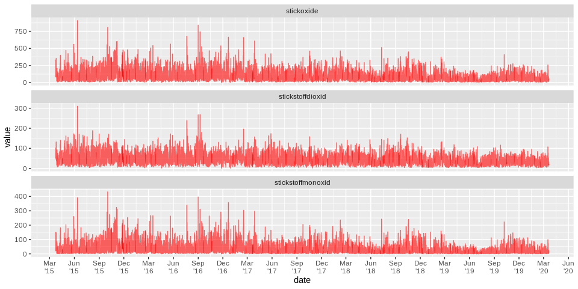
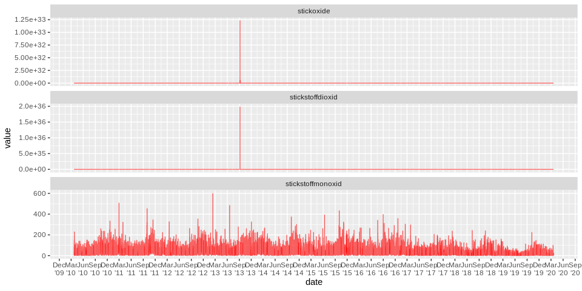

Air Pollution in Berlin during Corona
================
Maximilian Nölscher
2020-03-20

``` r
library(sf)
library(tidyverse)
library(lubridate)
```

# Data Import

Path to file

``` r
path_to_file <- "raw_data/ber_mc115_20190322-20200321.csv"
```

``` r
data_background <- read_csv2(path_to_file, skip = 3)
```

Column names

``` r
col_names <- read_csv2(path_to_file) %>% 
  slice(1) %>% 
  pivot_longer(cols = everything()) %>% 
  pull(value)
```

Rename columns of `data_background`

``` r
data_background <- data_background %>% 
  set_names(col_names) %>% 
  janitor::clean_names() %>% 
  rename(date = messkomponente)
```

Fix date column

``` r
data_background <- data_background %>% 
  mutate(date = dmy_hm(date))
```

Add columns for year, month, …

``` r
data_background <- data_background %>% 
  mutate(year = year(date)) %>% 
  mutate(month = month(date)) %>% 
  mutate(week = week(date)) %>% 
  mutate(day = day(date)) %>% 
  select(date, year, month, week, day, everything())
```

Show the dataframe

``` r
data_background
```

    ## # A tibble: 8,754 x 8
    ##    date                 year month  week   day stickstoffmonox…
    ##    <dttm>              <dbl> <dbl> <dbl> <int>            <dbl>
    ##  1 2019-03-22 00:00:00  2019     3    12    22                6
    ##  2 2019-03-22 01:00:00  2019     3    12    22               24
    ##  3 2019-03-22 02:00:00  2019     3    12    22               19
    ##  4 2019-03-22 03:00:00  2019     3    12    22                9
    ##  5 2019-03-22 04:00:00  2019     3    12    22                3
    ##  6 2019-03-22 05:00:00  2019     3    12    22                3
    ##  7 2019-03-22 06:00:00  2019     3    12    22                5
    ##  8 2019-03-22 07:00:00  2019     3    12    22               22
    ##  9 2019-03-22 08:00:00  2019     3    12    22               19
    ## 10 2019-03-22 09:00:00  2019     3    12    22               32
    ## # … with 8,744 more rows, and 2 more variables: stickstoffdioxid <dbl>,
    ## #   stickoxide <dbl>

# First visualizations

``` r
variables <- c("feinstaub_pm10", "stickstoffmonoxid", "stickstoffdioxid", "stickoxide", "ozon")
```

``` r
data_background %>% 
  pivot_longer(cols = one_of(variables)) %>% 
  ggplot(aes(date, value, group = name)) +
  geom_line(colour = 'red',
            alpha = .6) +
  scale_x_datetime(date_breaks = "month") +
  facet_wrap(~name, ncol = 1)
```


Weekly mean concentration

``` r
data_background %>% 
  pivot_longer(cols = one_of(variables)) %>% 
  group_by(name, week) %>% 
  summarise(mean = mean(value, na.rm = TRUE)) %>% 
  ggplot(aes(week, mean, group = name)) +
  geom_line(colour = 'red',
            alpha = .6) +
  # scale_x_datetime(date_breaks = "month") +
  facet_wrap(~name, ncol = 1)
```



Daily values compared to period mean

``` r
data_background %>% 
  pivot_longer(cols = one_of(variables)) %>% 
  group_by(name) %>% 
  mutate(mean = mean(value, na.rm = TRUE)) %>% 
  ungroup() %>% 
  group_by(name) %>% 
  mutate(diff_to_mean = value - mean) %>% 
  ungroup() %>% 
  group_by(name, year, month, day) %>% 
  summarise(daily_mean_diff_to_mean = mean(diff_to_mean, na.rm = TRUE)) %>% 
  mutate(date = as_date(str_c(year, month, day, sep = "-")),
         colour_category = if_else(daily_mean_diff_to_mean <= 0 , "negativ", "positiv")) %>% 
  ggplot(aes(date, daily_mean_diff_to_mean, group = name, fill = daily_mean_diff_to_mean)) +
  geom_col() +
  # scale_fill_manual() +
  scale_fill_gradient2(low='darkgreen', mid='snow3', high='red') +
  scale_x_date(date_breaks = "month",
               # date_minor_breaks = "1 month",
               date_labels = "%B\n'%y") +
  theme(legend.position = "none") +
  facet_wrap(~name, ncol = 1)
```



Daily values compared to period mean

``` r
data_background %>% 
  pivot_longer(cols = one_of(variables)) %>% 
  group_by(name) %>% 
  mutate(mean = mean(value, na.rm = TRUE)) %>% 
  ungroup() %>% 
  group_by(name) %>% 
  mutate(diff_to_mean = value - mean) %>% 
  ungroup() %>% 
  group_by(name, year, month, day) %>% 
  summarise(daily_mean_diff_to_mean = mean(diff_to_mean, na.rm = TRUE)) %>% 
  mutate(date = as_date(str_c(year, month, day, sep = "-")),
         colour_category = if_else(daily_mean_diff_to_mean <= 0 , "negative", "positive")) %>% 
  ggplot(aes(date, 
             daily_mean_diff_to_mean)) +
  geom_area(fill = "red", 
            alpha = .3) +
  geom_ribbon(aes(ymin = 0, ymax = ifelse(daily_mean_diff_to_mean >= 0,0,daily_mean_diff_to_mean)), 
              fill = "green", 
              alpha = .3) +
  # scale_fill_manual() +
  # scale_fill_gradient2(low='darkgreen', mid='snow3', high='red') +
  scale_x_date(date_breaks = "month",
               # date_minor_breaks = "1 month",
               date_labels = "%B\n'%y") +
  theme(legend.position = "none") +
  facet_wrap(~name, ncol = 1)
```


